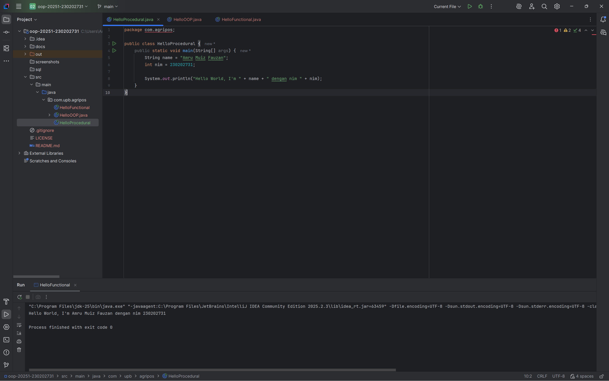
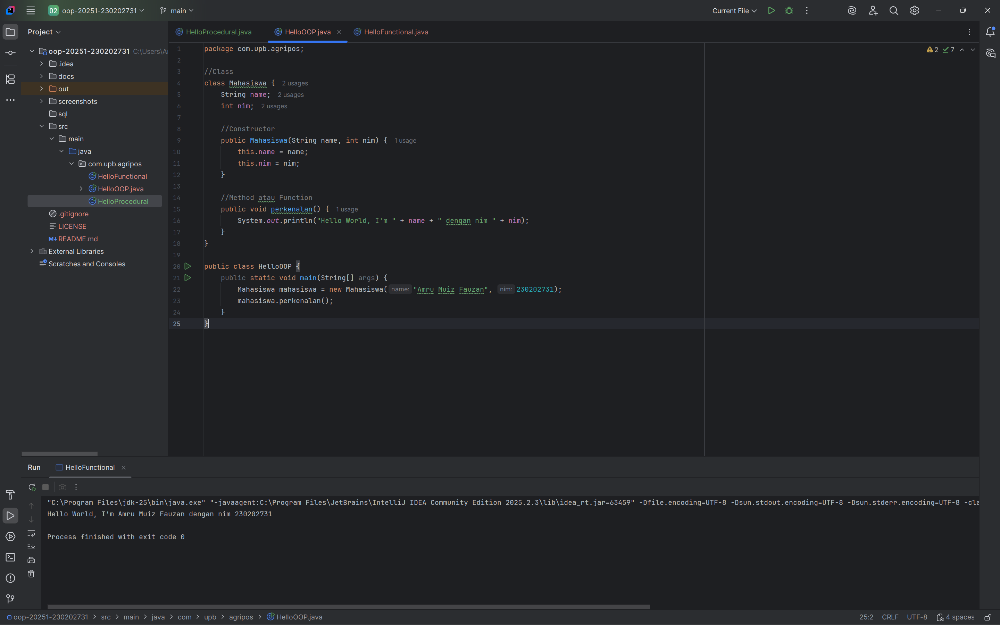
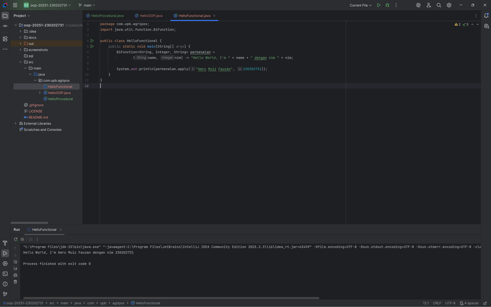

# Laporan Praktikum Minggu 1 (sesuaikan minggu ke berapa?)
Topik: Pengenalan Paradigma dan Setup Projek

## Identitas
- Nama  : Amru Muiz Fauzan
- NIM   : 230202731
- Kelas : 5IKRA

---

## Tujuan
```
- Mahasiswa mampu mendefinisikan paradigma prosedural, OOP, dan fungsional.
- Mahasiswa mampu membandingkan kelebihan dan keterbatasan tiap paradigma.
- Mahasiswa mampu memberikan contoh program sederhana untuk masing-masing paradigma.
- Mahasiswa aktif dalam diskusi kelas (bertanya, menjawab, memberi opini).
```
---

## Dasar Teori
Paradigma pemrograman merupakan landasan fundamental dalam pengembangan perangkat lunak yang memengaruhi cara pengembang merancang struktur program, mengelola data, dan menyusun logika pemrosesan. Paradigma prosedural merupakan salah satu pendekatan klasik di mana program disusun sebagai rangkaian instruksi atau langkah-langkah terurut yang dipecah menjadi fungsi dan prosedur. Setiap prosedur dirancang untuk menyelesaikan tugas tertentu dan dieksekusi sesuai alur logika yang telah ditentukan secara linear. Paradigma ini efektif untuk aplikasi berskala kecil hingga menengah yang memiliki alur kerja yang jelas, namun seiring bertambahnya kompleksitas sistem, risiko terjadinya duplikasi kode dan kesulitan pemeliharaan dapat meningkat karena keterkaitan antar fungsi menjadi semakin erat. Dalam konteks sistem Agri-POS (Agriculture Point of Sale), paradigma prosedural dapat digunakan pada tahap awal untuk mempercepat pengembangan fitur dasar seperti input transaksi dan perhitungan total harga, namun akan kurang fleksibel saat sistem berkembang dan membutuhkan modularitas yang lebih tinggi.

Sebaliknya, paradigma Object-Oriented Programming (OOP) menawarkan pendekatan yang lebih modern dengan merepresentasikan komponen sistem sebagai objek yang memiliki atribut (data) dan method (perilaku). Melalui konsep utama seperti enkapsulasi, pewarisan, dan polimorfisme, OOP memungkinkan struktur program menjadi lebih modular, terorganisir, dan mudah diimplementasikan ulang. Dalam konteks sistem Agri-POS, entitas seperti Produk, Transaksi, Pelanggan, dan Pembayaran dapat dimodelkan sebagai objek yang berinteraksi satu sama lain sesuai alur bisnis. Misalnya, objek Produk memiliki atribut seperti nama, harga, dan stok, sementara objek Transaksi memproses pembelian dan mengurangi stok secara otomatis. Dengan pendekatan ini, sistem menjadi lebih mudah dikembangkan, diuji, dan dipelihara karena setiap objek dapat dimodifikasi tanpa mengganggu struktur utama program secara keseluruhan. Hal ini sangat relevan untuk sistem pertanian modern yang memerlukan integrasi dengan inventori, pemasaran digital, dan manajemen distribusi secara berkelanjutan.

Di sisi lain, paradigma fungsional memandang program sebagai kumpulan fungsi matematika murni yang menerima input dan menghasilkan output tanpa mengubah keadaan sistem (state). Pendekatan ini lebih menekankan pada ekspresi dan transformasi data melalui fungsi-fungsi bebas efek samping (pure functions), yang dapat meningkatkan keandalan sistem serta meminimalkan bug akibat perubahan variabel global. Paradigma ini sangat efektif untuk pengolahan data berskala besar, optimasi logika perhitungan, dan proses komputasi paralel. Dalam implementasi Agri-POS, paradigma fungsional dapat diterapkan pada modul perhitungan diskon dinamis, pengelolaan prediksi stok berbasis data statistik, serta analisis penjualan menggunakan algoritma fungsional. Dengan demikian, kombinasi OOP sebagai kerangka utama dan paradigma fungsional sebagai pendukung pengolahan data akan memberikan solusi yang adaptif, scalable, dan efisien untuk pengembangan sistem Agri-POS yang terintegrasi dan berorientasi masa depan.

---

## Langkah Praktikum
1. Setup project: instal JDK, Intellij IDEA, Git, PostgreSQL dan JFX; membuat folder project oop-pos-230202731; git init repo; buat struktur awal src/main/java/com/upb/agripos/; memastikan semua tools dapat berjalan.
2. Membuat program sederhana dalam tiga paradigma: prosedural; oop; fungsional
3. Melakukan commit + push dengan pesan `` week1-setup-hello-pos ``.

---

## Kode Program
Prosedural
```java
package com.agripos;

public class HelloProcedural {
    public static void main(String[] args) {
        String name = "Amru Muiz Fauzan";
        int nim = 230202731;

        System.out.println("Hello World, I'm " + name + " dengan nim " + nim);
    }
}
```

OOP
```java
package com.upb.agripos;

//Class
class Mahasiswa {
    String name;
    int nim;

    //Constructor
    public Mahasiswa(String name, int nim) {
        this.name = name;
        this.nim = nim;
    }

    //Method atau Function
    public void perkenalan() {
        System.out.println("Hello World, I'm " + name + " dengan nim " + nim);
    }
}

public class HelloOOP {
    public static void main(String[] args) {
        Mahasiswa mahasiswa = new Mahasiswa("Amru Muiz Fauzan", 230202731);
        mahasiswa.perkenalan();
    }
}
```

Fungsional
```java
package com.upb.agripos;
import java.util.function.BiFunction;

public class HelloFunctional {
    public static void main(String[] args) {
        BiFunction<String, Integer, String> perkenalan =
                (name, nim) -> "Hello World, I'm " + name + " dengan nim " + nim;

        System.out.println(perkenalan.apply("Amru Muiz Fauzan", 230202731));
    }
}
```

---

## Hasil Eksekusi




---

## Analisis
Dari ketiga paradigma tersebut, kita bisa mengetahui fokus masing-masing paradigma seperti apa. 

Pertama untuk prosedural memiliki fokus pada urutan prosedur kode dan semua logika langsung ditulis di ``main``.

Kedua untuk OOP lebih fokus pada objek dan class, ada constructor dan method. Data dibungkus ke dalam objek dan perilaku ditentukan oleh method. OOP ini memungkinkan untuk ngoding secara modular dan reusable.

Ketiga untuk functional lebih fokus pada ``apa yang ingin dicapai`` daripada mementingkan langkah-langkahnya. Fungsi dianggap sebagai nilai, dan menggunakan lambda.

---

## Kesimpulan
Secara keseluruhan, setiap paradigma pemrograman memiliki karakteristik dan keunggulan yang berbeda sesuai dengan kebutuhan sistem yang dikembangkan. Paradigma prosedural efektif untuk aplikasi berskala kecil dengan alur linear, namun menjadi kurang efisien ketika kompleksitas bertambah. Paradigma OOP menawarkan struktur modular yang memudahkan pengelolaan entitas dunia nyata, meningkatkan maintainability dan scalability, sehingga lebih sesuai untuk sistem kompleks seperti aplikasi POS yang membutuhkan pengelolaan objek secara berkelanjutan. Sementara itu, paradigma fungsional memberikan efisiensi dalam pengolahan data dan mengurangi duplikasi kode melalui pendekatan fungsi murni yang konsisten dan bebas efek samping. Dengan demikian, pemilihan paradigma yang tepat akan secara langsung memengaruhi kualitas arsitektur perangkat lunak, kemudahan pengembangan jangka panjang, serta tingkat keandalan sistem.

---

## Quiz
```
Apakah OOP selalu lebih baik dari prosedural?
Tidak selalu. OOP lebih unggul untuk sistem kompleks yang membutuhkan modularitas dan pemodelan objek dunia nyata. Namun, untuk program sederhana dengan alur linear, paradigma prosedural justru lebih efisien dan mudah diimplementasikan.

Kapan functional programming lebih cocok digunakan dibanding OOP atau prosedural?
Kapan functional programming lebih cocok digunakan dibanding OOP atau prosedural?
Functional programming lebih cocok digunakan pada aplikasi yang berfokus pada pengolahan data, komputasi paralel, analisis statistik, dan transformasi data dalam jumlah besar karena paradigma ini meminimalkan efek samping dan meningkatkan konsistensi output.

Bagaimana paradigma (prosedural, OOP, fungsional) memengaruhi maintainability dan scalability aplikasi?
Bagaimana paradigma (prosedural, OOP, fungsional) memengaruhi maintainability dan scalability aplikasi?
Paradigma prosedural memiliki maintainability yang rendah saat aplikasi tumbuh besar karena sulit dikelola. OOP meningkatkan maintainability dan scalability melalui struktur modular berbasis objek. Functional programming meningkatkan keandalan dan skalabilitas dengan kode yang bersifat stateless dan mudah diparalelisasi.

Mengapa OOP lebih cocok untuk mengembangkan aplikasi POS dibanding prosedural?
Mengapa OOP lebih cocok untuk mengembangkan aplikasi POS dibanding prosedural?
OOP lebih cocok karena sistem POS memiliki banyak entitas seperti Produk, Transaksi, dan Pembayaran yang dapat dimodelkan sebagai objek. Pendekatan ini mempermudah pengembangan fitur baru, integrasi modul, dan pemeliharaan jangka panjang.

Bagaimana paradigma fungsional dapat membantu mengurangi kode berulang (boilerplate code)?
Paradigma fungsional menggunakan fungsi murni dan komposisi fungsi, sehingga satu fungsi dapat digunakan kembali di berbagai konteks tanpa perlu membuat kode tambahan. Hal ini mengurangi boilerplate dan membuat kode lebih ringkas, konsisten, dan mudah diuji.

```
