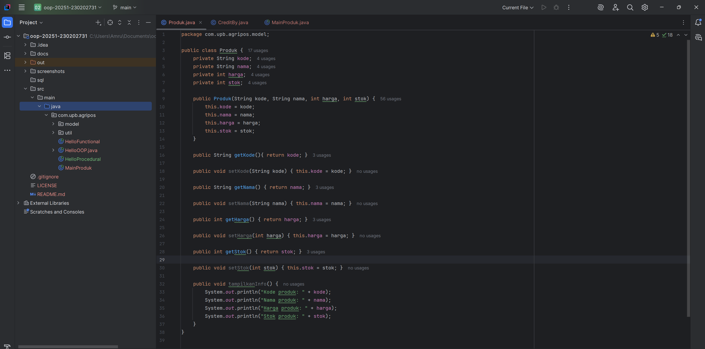
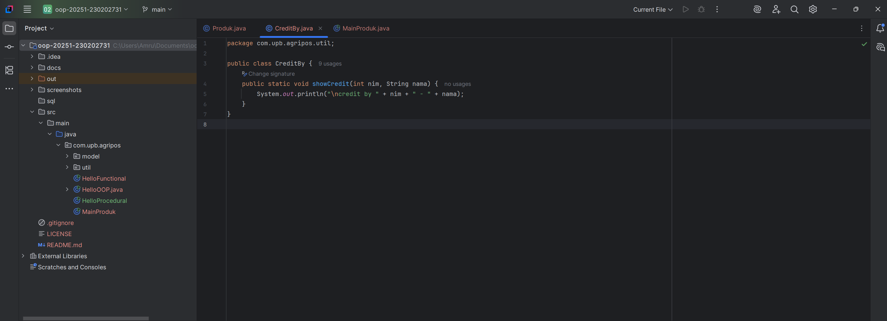
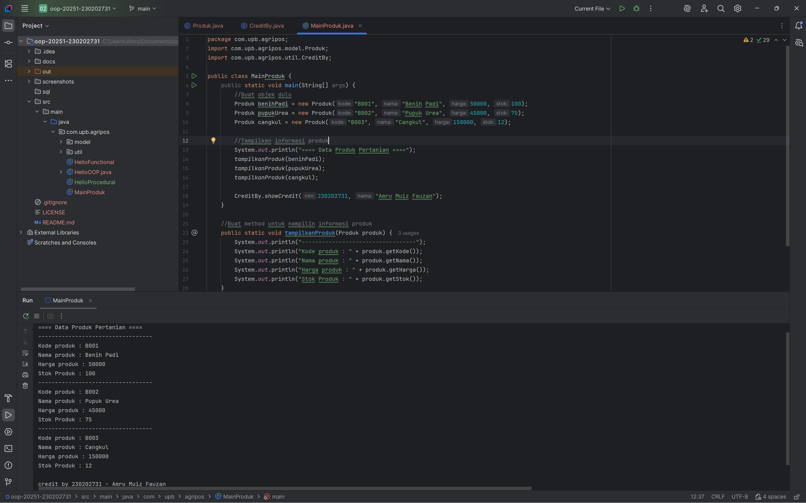

# Laporan Praktikum Minggu 2
Topik: Class dan Object (Produk Pertanian)

## Identitas
- Nama  : Amru Muiz Fauzan
- NIM   : 230202731
- Kelas : 5IKRA

---

## Tujuan
```
- Mahasiswa mampu menjelaskan konsep class, object, atribut, dan method dalam OOP.
- Mahasiswa mampu menerapkan access modifier dan enkapsulasi dalam pembuatan class.
- Mahasiswa mampu mengimplementasikan class Produk pertanian dengan atribut dan method yang sesuai.
- Mahasiswa mampu mendemonstrasikan instansiasi object serta menampilkan data produk pertanian di console.
- Mahasiswa mampu menyusun laporan praktikum dengan bukti kode, hasil eksekusi, dan analisis sederhana.
```

---

## Dasar Teori
Dalam paradigma Object-Oriented Programming (OOP), class diposisikan sebagai blueprint atau cetak biru yang mendefinisikan struktur dan perilaku suatu objek dalam sistem. Class tidak langsung merepresentasikan data nyata, tetapi berfungsi sebagai kerangka untuk membentuk objek melalui proses instansiasi. Setiap objek yang dihasilkan dari class memiliki atribut sebagai representasi data atau karakteristik, serta method yang menggambarkan perilaku atau fungsi yang dapat dilakukan objek tersebut. Pendekatan ini memungkinkan pengembang membangun program dengan struktur yang lebih sistematis, karena setiap entitas dalam sistem direpresentasikan secara jelas sesuai dengan sifat dan fungsinya.

Konsep inti dalam OOP adalah enkapsulasi, yaitu mekanisme untuk melindungi data dengan membatasi akses langsung dari luar class. Enkapsulasi diwujudkan melalui penggunaan *access modifier* seperti public, private, dan protected untuk menentukan tingkat akses suatu atribut atau method. Atribut yang bersifat private hanya dapat diakses secara langsung dari dalam class, sehingga untuk berinteraksi dengannya digunakan method khusus seperti getter dan setter. Pendekatan ini tidak hanya menjaga keamanan data, tetapi juga memungkinkan kontrol penuh terhadap bagaimana data dimanipulasi, sehingga mencegah terjadinya inkonsistensi dalam sistem. Dengan demikian, enkapsulasi menjadi elemen penting yang meningkatkan integritas, keamanan, dan keteraturan dalam pemrograman berbasis objek.

Dalam konteks implementasi Agri-POS, class dapat digunakan untuk memodelkan produk pertanian seperti benih, pupuk, pestisida, dan alat pertanian sebagai objek nyata yang memiliki atribut nama produk, harga, kategori, dan jumlah stok. Melalui pendekatan ini, setiap produk dapat dibuat sebagai objek yang berdiri sendiri namun tetap mengikuti struktur yang ditentukan oleh class induk. Sebagai contoh, class Produk dapat memiliki method untuk meng-update stok, menghitung total harga berdasarkan jumlah pembelian, atau mengecek status ketersediaan produk. Dengan pendekatan OOP ini, sistem Agri-POS menjadi lebih mudah dikelola, diperluas, dan diintegrasikan dengan fitur baru seperti manajemen transaksi atau laporan penjualan, sehingga meningkatkan efisiensi operasional secara keseluruhan.

---

## Langkah Praktikum
1. Buat class produk
2. Buat class creditby
3. Buat objek produk dan tampilkan credit
4. Commit + push

---

## Kode Program
Class Produk
```java
package com.upb.agripos.model;

public class Produk {
    private String kode;
    private String nama;
    private int harga;
    private int stok;

    public Produk(String kode, String nama, int harga, int stok) {
        this.kode = kode;
        this.nama = nama;
        this.harga = harga;
        this.stok = stok;
    }

    public String getKode(){ return kode; }

    public void setKode(String kode) { this.kode = kode; }

    public String getNama() { return nama; }

    public void setNama(String nama) { this.nama = nama; }

    public int getHarga() { return harga; }

    public void setHarga(int harga) { this.harga = harga; }

    public int getStok() { return stok; }

    public void setStok(int stok) { this.stok = stok; }

    public void tampilkanInfo() {
        System.out.println("Kode produk: " + kode);
        System.out.println("Nama produk: " + nama);
        System.out.println("Harga produk: " + harga);
        System.out.println("Stok produk: " + stok);
    }
}
```

Class CreditBy
```java
package com.upb.agripos.util;

public class CreditBy {
    public static void showCredit(int nim, String nama) {
        System.out.println("\ncredit by " + nim + " - " + nama);
    }
}
```

Objek Produk dan Tampilkan Credit
```java
package com.upb.agripos;
import com.upb.agripos.model.Produk;
import com.upb.agripos.util.CreditBy;

public class MainProduk {
    public static void main(String[] args) {
        //Buat objek dulu
        Produk benihPadi = new Produk("B001", "Benih Padi", 50000, 100);
        Produk pupukUrea = new Produk("B002", "Pupuk Urea", 45000, 75);
        Produk cangkul = new Produk("B003", "Cangkul", 150000, 12);

        //Tampilkan informasi produk
        System.out.println("==== Data Produk Pertanian ====");
        tampilkanProduk(benihPadi);
        tampilkanProduk(pupukUrea);
        tampilkanProduk(cangkul);

        CreditBy.showCredit(230202731, "Amru Muiz Fauzan");
    }

    //Buat method untuk nampilin informasi produk
    public static void tampilkanProduk(Produk produk) {
        System.out.println("----------------------------------");
        System.out.println("Kode produk : " + produk.getKode());
        System.out.println("Nama produk : " + produk.getNama());
        System.out.println("Harga produk : " + produk.getHarga());
        System.out.println("Stok Produk : " + produk.getStok());
    }
}
```

---

## Hasil Eksekusi




---


## Kesimpulan
Dalam pemrograman berbasis objek, class berfungsi sebagai cetak biru yang menentukan atribut dan perilaku objek, sementara objek adalah instansiasi nyata dari class tersebut. Konsep enkapsulasi diterapkan melalui deklarasi atribut sebagai private dan penggunaan getter serta setter untuk mengontrol akses terhadap data, sehingga integritas informasi tetap terjaga dan sistem menjadi lebih aman dari manipulasi sembarangan. Dengan menerapkan struktur OOP pada aplikasi seperti Agri-POS, entitas nyata seperti Produk pertanian dapat dimodelkan secara terstruktur dan terstandarisasi, memungkinkan pengembangan fitur lanjutan seperti manajemen inventori, transaksi terintegrasi, hingga sistem laporan otomatis. Hal ini membuktikan bahwa penerapan class, enkapsulasi, dan pengelolaan atribut secara tepat tidak hanya meningkatkan efisiensi pengembangan perangkat lunak, tetapi juga menjamin skalabilitas dan kualitas sistem dalam jangka panjang.

---

## Quiz
``Mengapa atribut sebaiknya dideklarasikan sebagai private dalam class?`` Atribut sebaiknya dideklarasikan sebagai private untuk menjaga keamanan dan konsistensi data. Dengan membatasi akses langsung dari luar class, atribut terlindungi dari manipulasi yang tidak valid atau tidak sesuai dengan aturan logika sistem.

``Apa fungsi getter dan setter dalam enkapsulasi?`` Getter digunakan untuk mengambil nilai atribut secara aman, sedangkan setter digunakan untuk mengubah nilai atribut dengan validasi tertentu. Keduanya memastikan akses data tetap terkontrol dan sesuai dengan aturan yang ditentukan dalam class.

``Bagaimana cara class Produk mendukung pengembangan aplikasi POS yang lebih kompleks?`` Class Produk memungkinkan setiap item pertanian direpresentasikan sebagai objek dengan struktur yang terstandar. Hal ini mempermudah integrasi fitur seperti manajemen stok, perhitungan harga otomatis, diskon, dan laporan penjualan, sehingga aplikasi POS dapat dikembangkan secara modular dan scalable.
